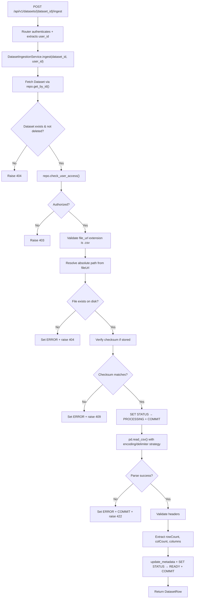
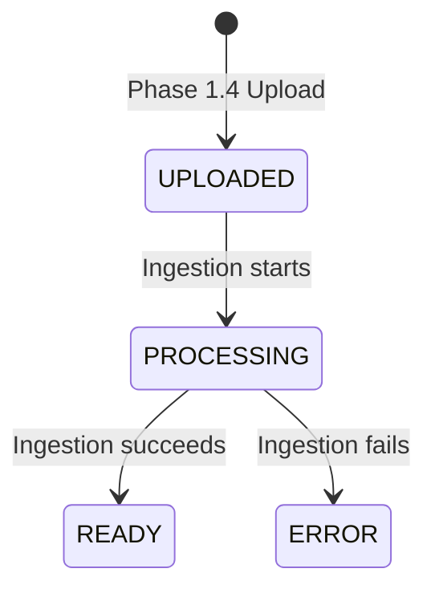

# Sub-Phase 1.5 — CSV Ingestion & Metadata Extraction

## A. Current Architecture Findings

### Prisma Schema — `columns` Field

The [`Dataset`](file:///c:/projects/ai-analytics/pandas-stat/prisma/schema.prisma#L172-L202) model defines:

```prisma
columns       Json?
rowCount      Int?
colCount      Int?
checksum      String?
status        DatasetStatus @default(UPLOADED)
```

**`columns` is `Json?`** — a nullable JSON column in PostgreSQL. The SQLAlchemy table in [`tables.py`](file:///c:/projects/ai-analytics/pandas-stat/stat-engine/app/db/tables.py#L72) mirrors this as `Column("columns", JSON, nullable=True)`. The Pydantic schema in [`dataset.py`](file:///c:/projects/ai-analytics/pandas-stat/stat-engine/app/schemas/dataset.py#L52) types it as `columns: Any | None = None`.

**Conclusion:** `columns` can store any valid JSON. A list of column-name strings (or list of objects with name/dtype) is fully compatible. **No schema change needed.**

### DatasetStatus Enum

Defined in [`dataset.py`](file:///c:/projects/ai-analytics/pandas-stat/stat-engine/app/schemas/dataset.py#L17-L23): `UPLOADED`, `PROCESSING`, `READY`, `ERROR` — exactly what ingestion needs.

### Upload Service

[`DatasetUploadService`](file:///c:/projects/ai-analytics/pandas-stat/stat-engine/app/services/dataset_upload_service.py) stores files at:
```
/uploads/{project_id}/{cuid}.csv
```
The absolute path is resolved via `settings.upload_dir`. Checksum stored as `sha256:{hex}` via `update_metadata(checksum=f"sha256:{checksum}")`.

### Repository Capabilities

[`DatasetRepository`](file:///c:/projects/ai-analytics/pandas-stat/stat-engine/app/repositories/dataset_repo.py) already provides everything needed:

| Method | Reusable for Ingestion? |
|---|---|
| `get_by_id(dataset_id)` | ✅ Fetch dataset record, check existence + soft-delete |
| `update_status(dataset_id, status)` | ✅ Set PROCESSING / READY / ERROR |
| `update_metadata(dataset_id, **fields)` | ✅ Persist `rowCount`, `colCount`, `columns`, `checksum` |
| `check_user_access(dataset_id, user_id)` | ✅ Authorization for the ingest endpoint |

**No new repository methods are needed.**

### Existing Tests: 40/40

| File | Tests |
|---|---|
| `test_db.py` | 3 |
| `test_health.py` | 1 |
| `test_dataset_repo.py` | 21 |
| `test_dataset_upload.py` | 15 |

---

## B. Existing Code That Can Be Reused

| Component | Location | Reuse |
|---|---|---|
| `DatasetRepository` | [`dataset_repo.py`](file:///c:/projects/ai-analytics/pandas-stat/stat-engine/app/repositories/dataset_repo.py) | `get_by_id`, `update_status`, `update_metadata` |
| `DatasetRow` schema | [`dataset.py`](file:///c:/projects/ai-analytics/pandas-stat/stat-engine/app/schemas/dataset.py#L42-L62) | Return type from the ingest endpoint |
| `DatasetStatus` enum | [`dataset.py`](file:///c:/projects/ai-analytics/pandas-stat/stat-engine/app/schemas/dataset.py#L17-L23) | Status transitions |
| `Settings.upload_dir` | [`config.py`](file:///c:/projects/ai-analytics/pandas-stat/stat-engine/app/config.py#L31) | Resolve file paths |
| Auth dependencies | [`auth.py`](file:///c:/projects/ai-analytics/pandas-stat/stat-engine/app/dependencies/auth.py) | `verify_internal_secret`, `get_user_id` |
| Router structure | [`router.py`](file:///c:/projects/ai-analytics/pandas-stat/stat-engine/app/api/v1/datasets/router.py) | Add ingest route to existing router |
| Test patterns | [`test_dataset_upload.py`](file:///c:/projects/ai-analytics/pandas-stat/stat-engine/tests/test_dataset_upload.py) | Fixture/teardown pattern, client setup |

---

## C. Proposed Ingestion Flow



---

## D. Proposed File Structure

```
stat-engine/app/
├── services/
│   ├── dataset_upload_service.py     ← UNCHANGED
│   └── dataset_ingestion_service.py  ← NEW
│
├── utils/
│   ├── ids.py                        ← UNCHANGED
│   └── file_utils.py                 ← NEW (checksum verification)
│
├── api/v1/datasets/
│   └── router.py                     ← MODIFIED (add ingest route)
│
└── schemas/
    └── dataset.py                    ← UNCHANGED

stat-engine/tests/
└── test_dataset_ingestion.py         ← NEW
```

Only **3 files created**, **1 file modified** (router).

---

## E. Proposed CSV Parsing Strategy

### Encoding Strategy

1. **Primary:** Try `utf-8-sig` (handles both plain UTF-8 and UTF-8 with BOM transparently — Python's `utf-8-sig` codec strips the BOM if present, passes through cleanly if absent).
2. **Fallback:** Try `latin-1` (ISO-8859-1). This codec never fails because every byte 0x00–0xFF maps to a valid character. It covers most Western European CSV files that aren't UTF-8.
3. **No further fallback.** If the file contains non-Latin characters that aren't UTF-8, the user must re-upload as UTF-8. This is a deliberate constraint to avoid silent data corruption from incorrect encoding guesses.

**Rationale:** `chardet`/`cchardet` sniffing is unreliable and can silently corrupt data. Two-step (utf-8-sig → latin-1) covers >99% of CSV files in practice.

### Delimiter Strategy

Use Python's `csv.Sniffer` on the first few KB of the file to detect the delimiter from `{',', ';', '\t'}`. If sniffing fails or returns an unexpected delimiter, default to `,`.

**Implementation:**
1. Read the first 8 KB of the file content.
2. Call `csv.Sniffer().sniff(sample, delimiters=',;\t')`.
3. Use the detected delimiter for `pd.read_csv(sep=...)`.
4. If sniffing raises an exception, fall back to `sep=','`.

### Header Validation (after `pd.read_csv`)

1. **Zero columns:** Error — "No columns detected"
2. **All-empty column names:** Error — "CSV has no valid header"
3. **Any individual empty column name:** Error — "Empty column name detected at position N"
4. **Duplicate column names:** Error — "Duplicate column names: X, Y"
   - pandas by default appends `.1`, `.2` suffixes to duplicates. Instead, we'll use `pd.read_csv(header=0)` and then explicitly check the original header row for duplicates before relying on the DataFrame.

### Empty Dataset Handling

- **Zero bytes:** Already rejected by the upload service (Phase 1.4).
- **Header-only CSV (0 data rows):** This is **valid**. A CSV with columns but no data is a legitimate empty dataset. `rowCount=0`, `colCount=N`, `columns=[...]`, `status=READY`.

> [!IMPORTANT]
> **Decision required:** The spec asks whether header-only CSV should be valid or should fail. My recommendation is **valid (READY with rowCount=0)**. A header-only CSV is structurally sound and can represent an empty dataset to be populated later. Please confirm.

---

## F. Proposed Metadata Structure

After successful ingestion, `columns` will be persisted as a JSON array of objects:

```json
[
  {"name": "id", "dtype": "int64"},
  {"name": "name", "dtype": "object"},
  {"name": "age", "dtype": "int64"},
  {"name": "score", "dtype": "float64"}
]
```

**Why objects instead of plain strings?** The `dtype` field records the raw pandas dtype for each column. This is required by the spec ("basic pandas dtype extraction"). Storing it alongside the column name avoids needing a second query or join later. The `columns Json?` field supports this natively.

Persisted metadata:

| Field | Source | Example |
|---|---|---|
| `rowCount` | `len(df)` | `1000` |
| `colCount` | `len(df.columns)` | `12` |
| `columns` | `[{"name": col, "dtype": str(df[col].dtype)} for col in df.columns]` | See above |

---

## G. Dataset Status Transition Design



Transaction boundaries:

```
Transaction 1:  UPLOADED → PROCESSING  (commit immediately)
    ↓
File parsing (no open transaction)
    ↓
Transaction 2a: update_metadata + PROCESSING → READY  (commit on success)
Transaction 2b: PROCESSING → ERROR  (commit on failure)
```

This design ensures:
- The database is never locked during file I/O.
- The `PROCESSING` state is visible to other queries immediately.
- A crash during parsing leaves the dataset in `PROCESSING` (detectable as stuck).

---

## H. Error Handling Design

| Error | HTTP Status | Detail Message | Server Log |
|---|---|---|---|
| Dataset not found | 404 | "Dataset not found" | `dataset_id=...` |
| Dataset soft-deleted | 404 | "Dataset not found" | `dataset_id=... (deleted)` |
| User not authorized | 403 | "Access denied" | `user_id=... dataset_id=...` |
| Unsupported file type | 422 | "Only CSV files can be ingested" | `fileUrl=... ext=...` |
| File missing on disk | 422 | "Dataset file not found" | `path=... (full path logged server-side only)` |
| Checksum mismatch | 409 | "File integrity check failed" | `expected=... actual=...` |
| Encoding error | 422 | "Unable to read CSV: encoding not supported" | Full traceback |
| Parsing error | 422 | "Unable to parse CSV file" | Full traceback |
| Empty CSV (no content) | 422 | "CSV file is empty" | `dataset_id=...` |
| No valid header | 422 | "CSV has no valid header row" | Column details |
| Empty column name | 422 | "Empty column name at position N" | Column list |
| Duplicate columns | 422 | "Duplicate column names: X, Y" | Full column list |
| Database error | 500 | "Internal server error" | Full traceback |

All errors during/after PROCESSING → set status to ERROR with a commit before raising HTTP exception.

---

## I. Checksum Strategy

**Yes — verify checksum before parsing.**

Phase 1.4 stores `sha256:{hex}` in the `checksum` field. The ingestion service should:

1. Read the stored checksum from `dataset.checksum`.
2. If present (not null), compute SHA-256 of the file on disk.
3. Compare. If mismatch → set ERROR, raise 409.
4. If checksum is null (shouldn't happen, but defensive) → skip verification, log warning.

**Implementation:** Extract the hashing logic from [`DatasetUploadService._stream_to_disk()`](file:///c:/projects/ai-analytics/pandas-stat/stat-engine/app/services/dataset_upload_service.py#L172-L231) into a reusable utility in `app/utils/file_utils.py`. The upload service already computes SHA-256 on streaming bytes; the utility will compute it for an existing file on disk.

```python
# app/utils/file_utils.py
async def compute_file_sha256(path: Path, chunk_size: int = 64 * 1024) -> str:
    """Compute SHA-256 hex digest for a file on disk."""
    ...
```

---

## J. API Design

### New Endpoint

```http
POST /api/v1/datasets/{dataset_id}/ingest
```

Added to the existing [`router.py`](file:///c:/projects/ai-analytics/pandas-stat/stat-engine/app/api/v1/datasets/router.py). Same auth dependencies as upload (`verify_internal_secret` at router level, `get_user_id` dependency).

**Request:** No body. The dataset_id path parameter identifies the target.

**Response (200):**
```json
{
  "id": "cm...",
  "name": "Sales Dataset",
  "fileName": "test_sales.csv",
  "fileType": "text/csv",
  "fileSizeBytes": 1234,
  "fileUrl": "/uploads/proj123/abc.csv",
  "parquetUrl": null,
  "columns": [
    {"name": "id", "dtype": "int64"},
    {"name": "name", "dtype": "object"}
  ],
  "rowCount": 1000,
  "colCount": 2,
  "checksum": "sha256:abc...",
  "status": "READY",
  "projectId": "proj123",
  "createdAt": "...",
  "updatedAt": "..."
}
```

Uses the existing `DatasetRow` response model — no new schemas needed.

**Why a synchronous endpoint (not background)?** Celery/Redis are explicitly out of scope. A synchronous endpoint allows complete testing of the ingestion flow. The `DatasetIngestionService` is designed so that a future Celery worker can call `service.ingest(dataset_id, user_id)` directly without modification.

---

## K. Testing Plan

### New file: [`tests/test_dataset_ingestion.py`](file:///c:/projects/ai-analytics/pandas-stat/stat-engine/tests/test_dataset_ingestion.py)

Tests follow the established pattern from [`test_dataset_upload.py`](file:///c:/projects/ai-analytics/pandas-stat/stat-engine/tests/test_dataset_upload.py): module-scoped fixtures, CUID-based isolation, hard-delete teardown.

| # | Test Name | What It Verifies |
|---|---|---|
| 1 | `test_ingest_valid_csv` | Happy path: status=READY, rowCount, colCount, columns correct |
| 2 | `test_ingest_empty_file` | Zero-byte file on disk → ERROR (edge case: bypassed upload validation) |
| 3 | `test_ingest_header_only_csv` | Header-only → READY with rowCount=0 |
| 4 | `test_ingest_duplicate_columns` | Duplicate header names → ERROR 422 |
| 5 | `test_ingest_empty_column_name` | Empty column name → ERROR 422 |
| 6 | `test_ingest_dataset_not_found` | Non-existent dataset_id → 404 |
| 7 | `test_ingest_missing_file` | Dataset exists but file missing from disk → 422 + ERROR |
| 8 | `test_ingest_deleted_dataset` | Soft-deleted dataset → 404 |
| 9 | `test_ingest_malformed_csv` | Random binary data as .csv → ERROR 422 |
| 10 | `test_ingest_utf8_csv` | Standard UTF-8 → READY |
| 11 | `test_ingest_utf8_bom_csv` | UTF-8 BOM → READY, BOM stripped from header |
| 12 | `test_ingest_semicolon_csv` | `;` delimiter → READY, correct columns |
| 13 | `test_ingest_tab_csv` | `\t` delimiter → READY, correct columns |
| 14 | `test_ingest_checksum_match` | Correct checksum → ingestion proceeds |
| 15 | `test_ingest_checksum_mismatch` | Tampered file → ERROR 409 |
| 16 | `test_ingest_failure_sets_error_status` | Parse failure → DB status = ERROR |
| 17 | `test_ingest_metadata_persisted` | After ingestion, direct DB query confirms metadata |

**Total: 17 new tests + 40 existing = 57 tests**

### Helper Strategy

A helper function creates a dataset record + physical CSV file on disk, simulating what Phase 1.4's upload endpoint produces. This avoids calling the upload endpoint in every test (faster, more isolated).

---

## L. Security Risks

| Risk | Mitigation |
|---|---|
| Path traversal via `fileUrl` | Service resolves path by joining `settings.upload_dir` + relative fileUrl. Validate that the resolved path starts with upload_dir. |
| Client-supplied file path | Ingestion service reads `fileUrl` from the **database record**, never from request body. |
| Filesystem path exposure | Error messages never include absolute paths. Only logged server-side. |
| Malicious CSV (formula injection) | Not a concern for Phase 1.5 — we're extracting metadata, not rendering. |
| Resource exhaustion (large CSV) | 50 MB limit enforced at upload time. pandas reads the full file but 50 MB is manageable. |

---

## M. Performance Considerations

- **50 MB limit** is well within pandas' single-pass capability. No chunked processing needed.
- **Synchronous processing** is acceptable for Phase 1.5. Typical ingestion for a 50 MB CSV: <5 seconds.
- **Memory:** pandas will hold the DataFrame in memory (~2–5x the file size). For 50 MB, this is ~100–250 MB — acceptable for a single request.
- **Future-proofing:** `DatasetIngestionService.ingest()` is a standalone async method. A Celery worker can import and call it directly:
  ```python
  # Future Celery task (NOT implemented now)
  async def ingest_task(dataset_id, user_id):
      async with get_session() as session:
          service = DatasetIngestionService(session, settings)
          await service.ingest(dataset_id, user_id)
  ```
- **No DataFrame duplication:** The service reads the CSV once, extracts metadata, then discards the DataFrame.

---

## N. Definition of Done

- [x] Existing codebase inspected and documented
- [ ] `DatasetIngestionService` created
- [ ] `file_utils.py` utility created (SHA-256 verification)
- [ ] Ingest endpoint added to router
- [ ] pandas parses valid CSV files
- [ ] UTF-8 and UTF-8 BOM supported
- [ ] Delimiter detection (`,`, `;`, `\t`)
- [ ] Malformed CSV handled with ERROR status
- [ ] Empty dataset (header-only) handled
- [ ] Header validation (empty names, duplicates)
- [ ] rowCount, colCount, columns extracted and persisted
- [ ] Basic pandas dtype recorded per column
- [ ] Status transitions: UPLOADED → PROCESSING → READY/ERROR
- [ ] Checksum verification before parsing
- [ ] Physical file existence validated
- [ ] Path traversal prevented
- [ ] No filesystem paths exposed to clients
- [ ] No Prisma schema modified
- [ ] No auth code modified
- [ ] No Celery/Redis
- [ ] No Excel/SAV/SPSS
- [ ] No statistical analysis
- [ ] No variable profiling
- [ ] No AI/LLM calls
- [ ] 17 new tests pass
- [ ] 40 regression tests pass (57 total)
- [ ] Manual ingestion verified

---

## O. Open Questions Requiring Approval

> [!IMPORTANT]
> **1. Header-only CSV (0 data rows) — valid or error?**
> 
> My recommendation: **Valid** — set status to `READY` with `rowCount=0`. A header-only CSV is structurally sound. The columns and types can still be extracted from the header row. This is consistent with how pandas handles it (`pd.read_csv()` returns an empty DataFrame with the correct column names and dtypes).
> 
> Alternative: Reject as an error. Please confirm.

> [!IMPORTANT]
> **2. `columns` metadata format — list of objects or list of strings?**
> 
> My recommendation: **List of objects** `[{"name": "col", "dtype": "int64"}, ...]`. This stores the pandas dtype alongside the column name, fulfilling the spec's requirement for "basic pandas dtype extraction" without needing a separate query. The existing `Json?` field supports this.
> 
> Alternative: Plain string list `["col1", "col2", ...]` and store dtypes elsewhere or defer to variable profiling. Please confirm.

> [!IMPORTANT]
> **3. Duplicate column names — reject or rename?**
> 
> My recommendation: **Reject with an error (422)**. Duplicate column names indicate a malformed CSV that the user should fix. Silent renaming (pandas' default `.1` suffix behavior) could lead to unexpected downstream behavior.
> 
> Alternative: Accept with pandas' default `.1`, `.2` suffix renaming. Please confirm.

## Proposed Changes

### New Files

---

#### [NEW] `dataset_ingestion_service.py` — `app/services/dataset_ingestion_service.py`

The core ingestion service. Contains:
- `DatasetIngestionService` class (mirrors `DatasetUploadService` pattern)
- `ingest(dataset_id, user_id)` — main entry point
- Private methods for encoding detection, delimiter sniffing, header validation, metadata extraction
- All file I/O and pandas logic lives here (not in the repository)
- Uses `DatasetRepository` for all database operations

---

#### [NEW] `file_utils.py` — `app/utils/file_utils.py`

Small utility module:
- `compute_file_sha256(path: Path) -> str` — async SHA-256 computation for existing files
- `resolve_upload_path(upload_dir: str, file_url: str) -> Path` — safe path resolution with traversal prevention

---

#### [NEW] `test_dataset_ingestion.py` — `tests/test_dataset_ingestion.py`

17 integration tests following established patterns.

---

### Modified Files

#### [MODIFY] [`router.py`](file:///c:/projects/ai-analytics/pandas-stat/stat-engine/app/api/v1/datasets/router.py)

Add a single new route:
```python
@router.post("/{dataset_id}/ingest", response_model=DatasetRow, ...)
async def ingest_dataset(dataset_id: str, ...):
    service = DatasetIngestionService(session=session, settings=settings)
    return await service.ingest(dataset_id=dataset_id, user_id=user_id)
```

No other files are modified. No schema changes. No auth changes.

---

## Verification Plan

### Automated Tests

```bash
uv run pytest -v --tb=short
```

Expected: 57 tests, all passing (40 existing + 17 new).

### Manual Verification

1. Upload CSV via existing Phase 1.4 endpoint → confirm `status=UPLOADED`
2. Call `POST /api/v1/datasets/{id}/ingest` → confirm `status=READY`
3. Verify `rowCount`, `colCount`, `columns` in response
4. Query database directly to confirm persisted metadata
5. Upload a malformed CSV → ingest → confirm `status=ERROR`
6. Verify original CSV file remains on disk after both success and failure
